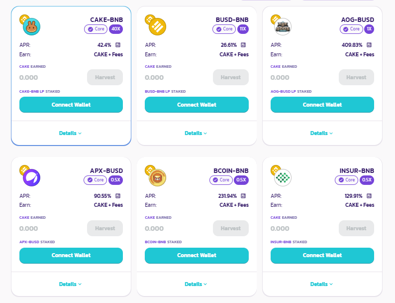

# Virago Farms

**Initial Liquidity Pools \(LPs\) for farming VIR tokens:**

**Reward multipliers:** (SAMPLE)

- VIR (10x Rewards)
- VIR-BUSD (40x Rewards)
- VIR-BNB (24x Rewards)
- BNB-BUSD (5x Rewards)
- DAI-BUSD (4x Rewards)
- BETH-ETH (4x Rewards)
- CAKE-BUSD (4x Rewards)
- CAKE-BNB (2x Rewards)
- BUSD (2x Rewards)
- BNB (1x Rewards)
- CAKE (1x Rewards)
- DAI (1x Rewards)

Virago collects a 3% deposit fee to periodically purchase VIR on the market and burn them.

This will reduce the supply and pump your bags!
